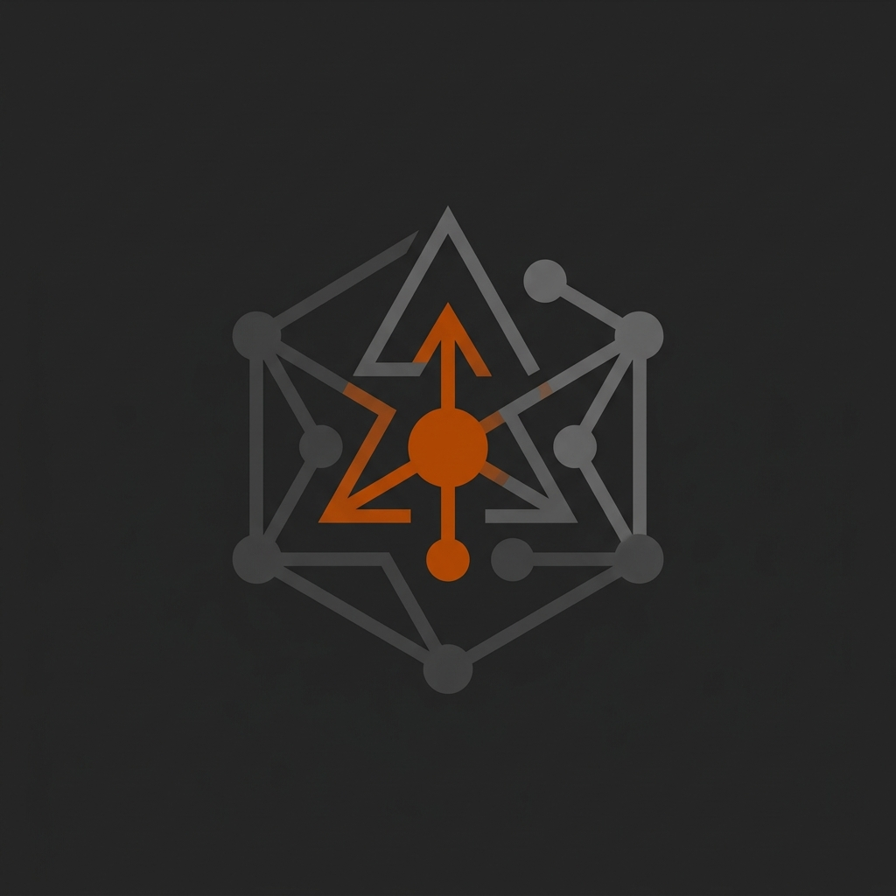

<div align="center">
  
  <h1>Agents Template</h1>
  <p>A clean, lightweight, and unopinionated starting point for building AI Agents with Pytron.</p>
</div>

---

## ⚡ Overview

This template provides the bare essentials needed to build a modern, native AI Agent desktop application using **Python** (Backend) and **React** (Frontend). It avoids heavy architectural opinions, letting you integrate your favorite LLM framework (LiteLLM, Langchain, OpenAI) while providing a beautiful, minimizable UI and syntax-highlighted markdown chat.

## ✨ Features

- **Beautiful Chat Interface:** Pre-built chat UI natively integrated with `marked` and `highlight.js` for perfect code block rendering.
- **Minimizable Sidebar:** Responsive and sleek sidebar for managing chat history and settings.
- **Python / JS Bridge:** Ready-to-use interceptor loop to handle tool calls seamlessly between your LLM and frontend.
- **Native OS Integration:** Packaged as a standalone desktop executable with Pytron's native engine.

## 📁 Project Structure

- `app.py` — The main Python entrypoint. **Start here** to integrate your LLM logic.
- `settings.json` — Application metadata, window dimensions, and Pytron configuration.
- `frontend/` — The React Vite application containing the UI components (`Chat.jsx`, `Sidebar.jsx`, etc.).
- `agents.md` — Reference documentation and guidelines for using the Pytron-kit API.

## 🚀 Getting Started

1. **Install Dependencies:**
   ```bash
   pytron install
   ```

2. **Run in Development Mode:**
   ```bash
   pytron run --dev
   ```
   *This starts both the Python backend and the Vite hot-reloading dev server.*

3. **Build & Package:**
   ```bash
   pytron package
   ```
   *Compiles your app into a standalone, native desktop executable.*

## 🛠 Integrating your LLM

Open `app.py` and locate the `[NEUTRAL TOOL CALL INTERCEPTOR]` comment. This is your blank canvas! Simply intercept the user's prompt, call your preferred LLM provider, execute any necessary tool calls in Python, and stream the tokens back to the frontend using `self.app.emit('ai_agent_event', ...)`!